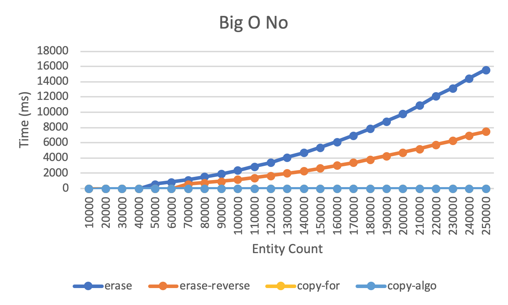
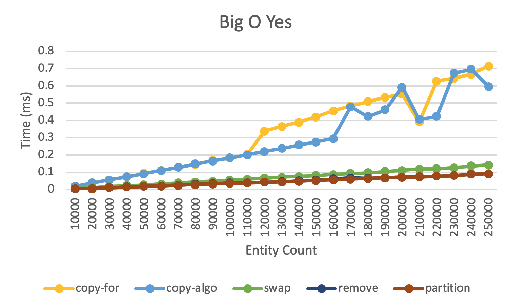

# Big O(h dear)

---

# The Setup

```c++
// 28 bytes
struct Entity {
    float x_, y_, z_;
    float w_, h_;
    bool alive_;
};

class World {
public:
    std::vector<Entity> entities_;

    void populate(int count);
    void depopulate();

    ...
};
```

---

[.code-highlight: all]
[.code-highlight: 5]
[.code-highlight: 8-16]

```c++
void populate(const int count) {
    std::mt19937 gen;
    gen.seed(1);

    std::bernoulli_distribution dist(0.5); // 50/50 alive or dead

    entities_.reserve(count);
    std::generate_n(
        std::back_inserter(entities_),
        count, [&]{
        return Entity {
            0.0f, 0.0f, 0.0f,
            1.0f, 1.0f,
            dist(gen)
        };
    });
}
```

---

```c++
class WorldFixture
    : public benchmark::Fixture
{
public:
  void SetUp(const ::benchmark::State& state) {
      world.populate(state.range(0));
  }

  void TearDown(const ::benchmark::State& state) {
      world.depopulate();
  }

  World world;
};
```

---

[.code-highlight: all]
[.code-highlight: 1, 4, 10]
[.code-highlight: 7,11-13]

```c++
BENCHMARK_DEFINE_F(WorldFixture, NAME)(benchmark::State& state)
{
    for (auto _ : state) {
        world.removeDeadEntities_name();
    }

    state.SetComplexityN(state.range(0));
}

BENCHMARK_REGISTER_F(WorldFixture, NAME)
    ->Unit(benchmark::kMillisecond)
    ->DenseRange(EntityCountBegin, EntityCountEnd, EntityCountIncrement)
    ->Complexity();
```

---

<br><br><br>

```c++
void removeDeadEntities_erase() {
    for (auto it = entities_.begin(); it != entities_.end();) {
        if (!it->alive_) {
            it = entities_.erase(it);
        } else {
            ++it;
        }
    }
}
```

---

[.code-highlight: all]
[.code-highlight: 4]

```c++
void removeDeadEntities_erase_reverse() {
    for (auto it = entities_.rbegin(); it != entities_.rend(); ++it) {
        if (!it->alive_) {
            entities_.erase(std::next(it).base());
        }
    }
}

void removeDeadEntities_erase_reverse_index() {
    for (int i = entities_.size() - 1; i >= 0; --i) {
        if (!entities_[i].alive_) {
            entities_.erase(entities_.begin() + i);
        }
    }
}
```

---

[.code-highlight: all]
[.code-highlight: 4-8,16-19]
[.code-highlight: 2-3,9-10,14-15,20-21]

```c++
void removeDeadEntities_copy_for() {
    std::vector<Entity> entities;
    entities.reserve(entities_.size()); // over allocate
    for (const auto& entity : entities_) {
        if (entity.alive_) {
            entities.push_back(entity);
        }
    }
    entities.shrink_to_fit();
    entities_ = std::move(entities);
}

void removeDeadEntities_copy_if() {
    std::vector<Entity> entities;
    entities.reserve(entities_.size()); // over allocate
    std::copy_if(
        entities_.begin(), entities_.end(),
        std::back_inserter(entities),
        [](const Entity& entity) { return entity.alive_; });
    entities.shrink_to_fit();
    entities_ = std::move(entities);
}
```

---

<br><br><br>

```c++
void removeDeadEntities_swap() {
    for (int i = 0; i < entities_.size();) {
        if (!entities_[i].alive_) {
            entities_[i] = entities_.back();
            entities_.pop_back();
        } else {
            i++;
        }
    }
}
```

---

<br><br><br><br><br><br>

```c++
void removeDeadEntities_remove_if() {
    entities_.erase(
        std::remove_if(
            entities_.begin(), entities_.end(),
            [](const Entity& entity) { return !entity.alive_; }),
        entities_.end());
}
```

---

<br><br><br><br><br><br>

```c++
void removeDeadEntities_partition() {
    entities_.erase(
        std::partition(
            entities_.begin(), entities_.end(),
            [](const Entity& entity) { return entity.alive_; }),
        entities_.end());
}
```

---



---



---

# [fit] algorithms
# [fit] FTW
